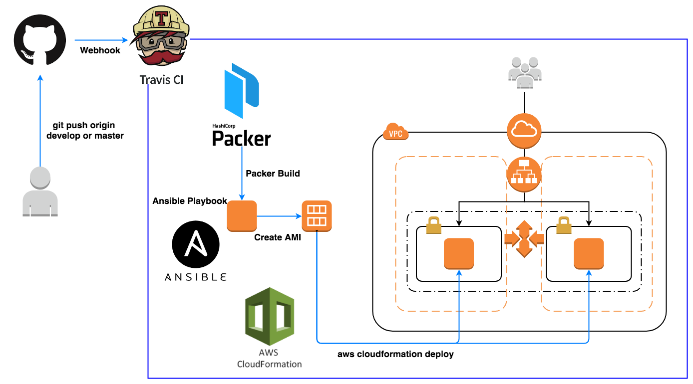
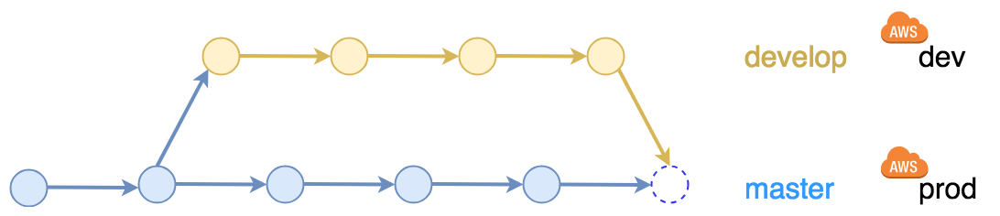

 [](https://coveralls.io/github/daisuke-awaji/aws?branch=master)

# Continuous Integration Flamework

**Automatically Build: Rails apps on AWS used by Packer, Ansible and Cloudformation**



Automatically build Rails application on AWS.
Packer creates AMI (Amazon Machine Image) after installing the middleware described by Ansible's Playbook.
The created AMI is handed over to Cloudformation parameters and deployed to the new environment.The series of processing is done automatically by Travis CI.

## Target Branches

It triggers that the source code is pushed to the following branch.

- develop: deploy in "dev" environment
- master: deploy to "prod" environment



## Usage

First of all, work on the develop branch and make sure that the behavior of Cloudformation and Ansible is OK on the dev environment. Pushing the develop branch to Github will automatically create the environment.

If there is no problem, if you merge it into master, it will be deployed to the prod environment.

## Notes

- Because we are using SpotInstance, when constructing AWS resources by Cloudformation, in rare cases EC2 instance can not be secured and there is a possibility of timeout. First of all, it may be better to build the AutoScaling group after building only VPC, Subnet. People who can afford the money delete the following lines. You can create instances reliably.
```diff
 # Use on-demand/spot instance in prod/dev.
+# SpotPrice: !If [ CreateProdResources, !Ref "AWS::NoValue", 0.06 ]
```
