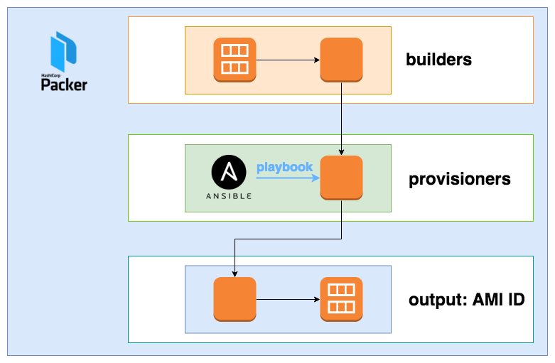

# Packer Build AMI

EC2 instance created temporarily when creating an Amazon Machine Image by Packer runs on the AWS default VPC.
Packer creates AMI after installing the middleware described by Ansible's Playbook.




## Usage

All you have to do is `packer build ./middleware/template.json`.

1. Packer create EC2 instance from base AMI.
1. Ansible install M/W into EC2 instance.
1. Packer create new AMI and delete EC2 isntance.

```.bash
$ packer build ./middleware/template.json
amazon-ebs output will be in this color.

==> amazon-ebs: Prevalidating AMI Name: web 1533118387
    amazon-ebs: Found Image ID: ami-b70554c8
==> amazon-ebs: Creating temporary keypair: packer_5b6187b3-e90e-1e92-d28e-94f7a151bf13
==> amazon-ebs: Creating temporary security group for this instance: packer_5b6187b7-f6ab-b024-582d-315e2dc70dc3
==> amazon-ebs: Authorizing access to port 22 from 0.0.0.0/0 in the temporary security group...
==> amazon-ebs: Launching a source AWS instance...
==> amazon-ebs: Adding tags to source instance
    amazon-ebs: Adding tag: "Name": "Packer Builder"
    amazon-ebs: Instance ID: i-0d7885d1379cd0b28
==> amazon-ebs: Waiting for instance (i-0d7885d1379cd0b28) to become ready...
```
